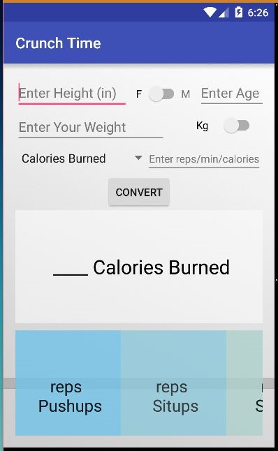

# PROG 01: Crunch Time

This app takes in age, height, weight, gender, workout, and time to calculate the number of calories burned.

## Authors

FirstName LastName ([smitajain@berkeley.edu](mailto:smitajain@berkeley.edu))

## Demo Video

See [your demo video title here] (https://www.youtube.com/watch?v=hwTdlWEiKUI&feature=youtu.be&hd=1)

## Screenshots

## Acknowledgments

* Hat tip to anyone who's code was used
* Any other support

*Feel free to enhance your README. For Markdown syntax, see [the GitHub Guides](https://guides.github.com/features/mastering-markdown/). Remove this line in your submission.*
